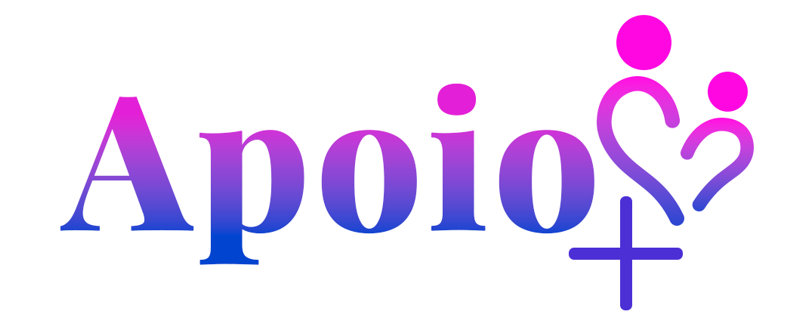

# Apoio+
Site de apoio a jovens egressos de abrigos institucionais!

|AUTORA|TAREFAS|
|:-----|:----:|
|Sarah Lorena Berton Piantkoski|Responsável pela identidade visual e design do site. Responsável também por se aprofundar nos temas relacionados ao nosso projeto, para repertório e escrita. Auxíliar na programação|
|Laís Aguirre Cota|Responsável pela sintetização das funcionalidades e requisições do projeto, documentando-as. Também responsável pela programação.|
  >BLOG: [blog](https://apoiadoresmais.blogspot.com/2025/11/historias-e-relatos.html)

